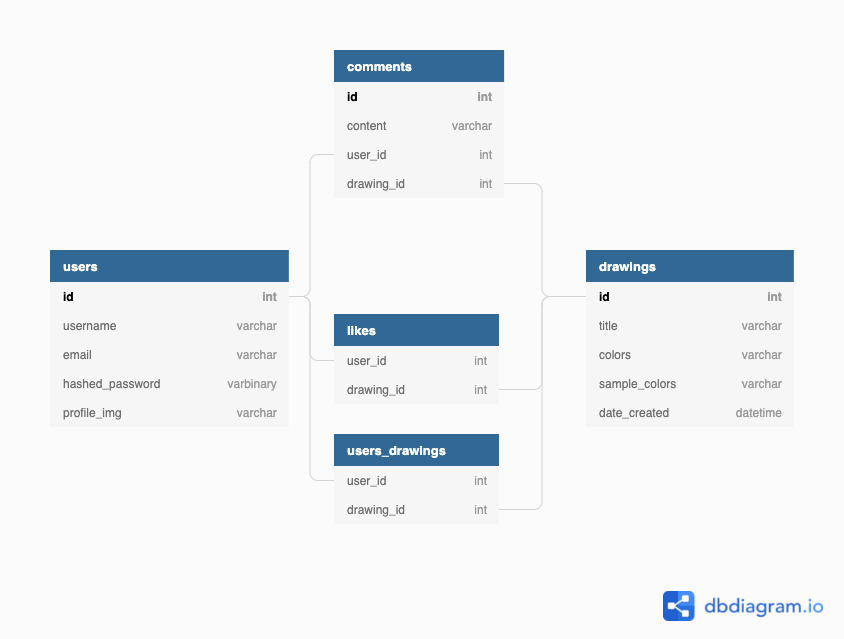

## Welcome to Copyxel
**Copyxel** is a mini memory game where users memorize a random pixel drawing within a time frame and draw a copy of it from memory. They can choose to delete their own drawings, view or like/save other users' drawings, or leave a comment on them.

## Live Site
https://copyxel.herokuapp.com/

## Technologies Used
* Front-end: React, Redux, JavaScript
* Front-end libraries: react-color, react-icons, swiper
* Back-end: Flask, Python, PostgreSQL
* Other: Heroku, Docker

## Database Schema

## Future Features
* Allow users to choose a difficulty level.
* Score drawings on the results page and display on each card.